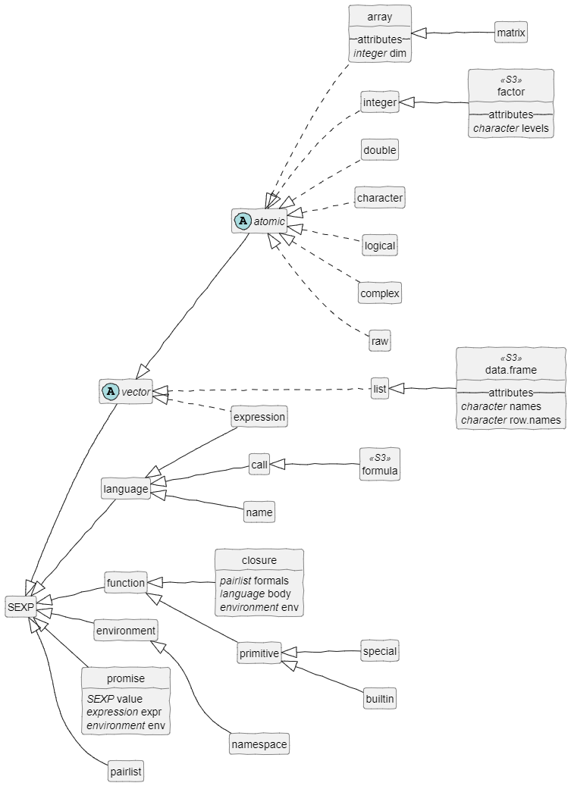

```{r, include = FALSE}
knitr::opts_chunk$set(
  collapse = TRUE,
  comment = "#>"
)
Sys.setenv(lang = "en_US")
```

```{r setup, include=FALSE}
library(huh)
```


Learning R can be hard. The language has grown and developed over several generations and it is carried by a community which is very much alive. The R core team holds everything together with a certain conservative attitude. R objects can be confusing for a newbie. Not only is there large variety of objects (that is quite normal for modern programming languages). The underlying paradigms vary. Though they may look similar the difference can make their handling quite difficult. 

The "huh?" package wants to describe objects to make it easier to understand what they contain and how to handle them.


# Data Objects

... (TBD)

## Subsetting

`how()` identifies ways to subset an object. That can be difficult at the beginning when you learn R. Wickham (2017) shows five different ways to extract a single value from a data frame. And you can easily recombine these five solutions to create even more.

```{r 5 ways}
# 5 subsetting ways by Wickham (2017)
mtcars[32, 11]
mtcars$carb[32]
mtcars[[c(11, 32)]]
mtcars[[11]][32]
.subset2(mtcars, 11)[32]
```

Five different ways? As you can see, the order of the numbers is **not even consistent**. The fastest solution outperforms the slowest by a factor of 30 in a simple example (i.e. the `mtcars` data set, see below). Yes, it can make quite a difference which way you choose.

How you are trying to access elements also determines the object type you get in return. A common mistake is this:

```{r, error=TRUE}
listofnumbers <- as.list(1:4)
listofnumbers[2] + listofnumbers[3]
```

when it should be `listofnumbers[[2]] + listofnumbers[[3]]`. Of course:

```{r typeof example}
ll <- list(1:3, letters[1:3], c(TRUE, FALSE, TRUE))
typeof(ll[1]) # returns "list"
typeof(ll[[1]]) # returns "integer"
```


Subsetting in R is powerful. But (in programming) power often means complexity. This is how the idea of `how()` came up: simply type `how(myobject)` and the console will print the **alternatives to subset** this and what **return types** you can expect. If this saves beginners from opening the manual just in 1 out of 2 cases, the huh-package is a big success, because it'll save you an incredible amount of time.


It returns an S3 object with the class `huh.how`. It is basically a list of operators nested by return type of the subset operation. An example:


The idea of `how` is that you do not need to check the documentation if you are unsure about subsetting. Just type `how(evilobject)` and you get the basic information in the console.


## Choosing a subsetting technique?

The different subsetting techniques differ a lot when it comes to performance. Here is a demonstration for data frames:

```{r performance of subsetting, echo=FALSE}
bench::mark(time_unit="us",
  # 5 ways by Wickham (2017)
  mtcars[32, 11],
  mtcars$carb[32],
  mtcars[[c(11, 32)]],
  mtcars[[11]][32],
  .subset2(mtcars, 11)[32],
  # Further combinations
  mtcars[[11]][[32]],
  mtcars[["carb"]][32],
  .subset2(mtcars, 11)[[32]],
  .subset2(mtcars, "carb")[32]
)[1:4]
```

The fastest is `.subset2()` with numeric indices. However, the manual recommends not to use it. And unless you are doing something extremely performance-hungry job, this may be wise. `.subset2` makes code harder to read and it is less reliable and do not allow missing arguments. `.subset2(mtcars, integer())` throws an error while `mtcars[integer()]` returns a data frame with 0 columns and 32 rows.

In a normal setting these may be suitable guidelines:

* Do not underestimate the simple `mtcars[32, 11]`. It has the most intuitive readability (IMHO) and provides the highest flexibility. Personally, without additional requirements this is always my first choice; especially when I do not write code only for myself.
* If you want more speed the pattern `mtcars$carb[c(...)]` is your friend. The disadvantage is that you cannot use variables or numeric indices with `$`. Another disadvantage is that you can only pick one column at a time.
* If you need to pick values using variables `mtcars[[11]][32]` is still quite fast. Again, you can only pick a single column with this.
  


# Functions

... (TBD)


# Special Issues

## How to identify a generic S3 function?

The clearest way is to find a call to `UseMethod()` in the body of the function. That is how `utils::isS3stdGeneric()` and `roxygen2::is_s3_generic()` do it. But that does not help with internal generics which are implemented in C. The only way to handle those is to get an exhaustive list of internal S3 generics. But how can one do that?

The `tools` package provides `.get_internal_S3_generics()`. This function does not seem to be safe. This function uses `.S3PrimitiveGenerics`. Because this list is incomplete it adds several names that are hard-coded in the function. That does not feel reliable.

There is another function that collects all internal generics in the package `R.methodsS3`. The local function `knownInternalGenericS3()` combines `names(.knownS3Generics)` and `.S3PrimitiveGenerics`. It further adds `tools::.get_internal_S3_generics()` if the package is available. At least this way we avoid a hard dependency. And, finally, the functions `cbind` and `rbind` are added.

After checking these functions and hours of research there may be a better way.  According to [R Internals: "Prototypes for primitives"](https://cran.r-project.org/doc/manuals/r-release/R-ints.html#Prototypes-for-primitives) `names(.GenericArgsEnv)` is an environment in the base package for those primitives which are internal S3 generics. And indeed, it provides lots of function names. 

The situation is rather confusing. Several different collections of internal generics but none of them seems complete. After comparing these lists:

* `cbind` and `rbind` would be already included  a union of `names(.knownS3Generics)` and `names(.GenericArgsEnv)`.
* So are the elements of `.S3PrimitiveGenerics`.

The cleanest way to get a list of 

1. Create a union of `names(.knownS3Generics)` and `names(.GenericArgsEnv)`.
2. Check if the `tools` package and it's function `.get_internal_S3_generics()` are available. If so, add it's result.


## How to identify an S3 method?

... (TBD)


## R Objects

Notes: 

* `S3` classes are marked.
* Obvious attributes are omitted, like a `class` attribute of an S3 class.
* For obvious reasons, derived objects share the attributes and data structure with their parents and are not repeated.




## Object Types

Here is an overview over types:

```{r echo=FALSE}
library(rmarkdown)
  myfunkyfunc <- function(x) print(x)
  class(myfunkyfunc) <- "Oh so funky"

  cex3 <- c("NULL", "1", "1:1", "1i",
            "list(1)", "data.frame(x = 1)", "pairlist(pi)",
            "c", "lm", "integer", "myfunkyfunc",
            "formals(lm)[[1]]",  "formals(lm)[[2]]",
            "y ~ x", "expression((1))[[1]]", "(y ~ x)[[1]]",
            "expression(x <- pi)[[1]][[1]]")
  lex3 <- sapply(cex3, function(x) eval(str2lang(x)))
  mex3 <- t(sapply(lex3,
                   function(x) c(typeof(x), class(x), mode(x), storage.mode(x))))
  dimnames(mex3) <- list(cex3, c("typeof(.)", "class(.)", "mode(.)", "storage.mode(.)"))
  as.data.frame(mex3) |> knitr::kable("markdown") 
```


Wickham (2017) confirms that `mode()` and `storage.mode()` are not really needed in R: "I recommend ignoring these functions because they’re just aliases of the names returned by `typeof()`, and exist solely for S compatibility." What is important are the basic types (`typeof()`) and the class. The class can be an implicit class provided by R. In that case it does not add much information to the type. 


# Sources


Bengtsson, H. [The R.oo package - Object-Oriented Programming with References Using Standard R Code](https://www.r-project.org/conferences/DSC-2003/Proceedings/Bengtsson.pdf), Proceedings of the 3rd International Workshop on Distributed Statistical Computing (DSC 2003), ISSN 1609-395X, Hornik, K.; Leisch, F. & Zeileis, A. (ed.), 2003. ([`R.methodsS3` package code](https://github.com/cran/R.methodsS3/blob/master/R))

Gupta, Suraj (2012). _[How R Searches and Finds Stuff](https://blog.thatbuthow.com/how-r-searches-and-finds-stuff/)_. accessed 2022-08-16

R Core Team (2022). _[R: A language and environment for statistical computing](https://www.R-project.org/)_. R Foundation for Statistical Computing, Vienna, Austria.
* Package [tools](https://github.com/wch/r-source/tree/79298c499218846d14500255efd622b5021c10ec/src/library/tools)
* Package [utils]()

R core team (2022). _[R Internals](https://cran.r-project.org/doc/manuals/r-release/R-ints.html)_. created for R, version 4.2.1, 2022-06-23.

R core team (2022). _[R Language Definition](https://cran.r-project.org/doc/manuals/r-release/R-lang.html)_. created for R, version 4.2.1, 2022-06-23.

Wickham, Hadley (2017). _[Advanced R](http://adv-r.had.co.nz/OO-essentials.html)_. 1st edition.

Wickham, Hadley (2019). [sloop: Helpers for 'OOP' in R](https://CRAN.R-project.org/package=sloop). R package version 1.0.1. 

Wickham, Hadley (2021). _[Advanced R](https://adv-r.hadley.nz/oo.html)_. 2nd edition. Chapman & Hall.

Wickham H., Danenberg P., Csárdi G., Eugster M. (2022). _[roxygen2: In-Line Documentation for R](https://CRAN.R-project.org/package=roxygen2)_. R package version 7.2.1.

